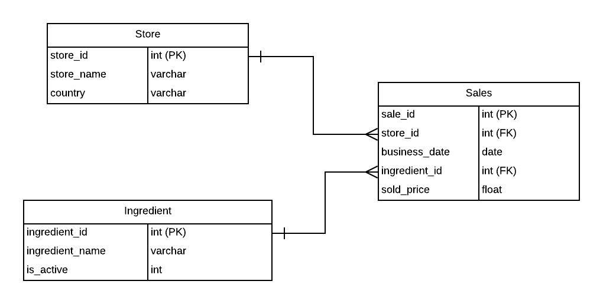

# Earls Take Home Assignment

Please download this repository and import all the contents into a new repository. Ensure that it has "Public" visibility to be shared with us.

Do your best to finish all the steps, but don't worry if you get stuck. Submit the assignment even if it's incomplete and we will go over it during the interview. Do not worry about HTML formatting in the Django app. 

## Part 1: Django App

Please use the skeleton code in `bigquery_sample` (basically just the code from the [Django intro tutorial](https://docs.djangoproject.com/en/3.2/intro/tutorial01/)) to complete the following:

1. Install python3, django, and [google-bigquery](https://googleapis.dev/python/bigquery/latest/index.html)
```
pip install django
pip install google-cloud-bigquery
```
2. Set up google cloud authentication by creating a service account and setting your local environment variable `GOOGLE_APPLICATION_CREDENTIALS` using [this link](https://cloud.google.com/bigquery/docs/quickstarts/quickstart-client-libraries#bigquery-simple-app-build-service-python).

3. Verify the app runs locally. Navigate to the folder in your repo that contains `manage.py` and run the following commands. Navigating to [localhost:8080](localhost:8080) in your browser should return `Hello, world.`
```
python manage.py migrate
python manage.py runserver
```

4. Create a view using the function `hacker_news` in `views.py` that is accessed by going to the url [localhost:8080/latest_hacker_news](localhost:8080/latest_hacker_news). This view should query the public dataset `hacker_news` from the project `bigquery-public-data` and print the title, author's name, and date of publication of the latest 5 articles from the `stories` table. 
   
5. Create a second view using the function `github` in `views.py` that is accessed by going to the url [localhost:8080/most_commits](localhost:8080/most_commits). You will be querying the `sample_commits` table in the public dataset `github_repos` (`bigquery-public-data.github_repos.sample_commits`). 

    Write a query to find the individuals with the most commits in this table in 2016. Display the name and number of commits sorted from most to least commits.
    

___

## Part 2: SQL 

Use the following ERD to answer the next set of questions. Please record your answers on `SQL_answers.sql`



1. Based on the ERD provided, write a SQL query to find the number of occurrences that an ingredient named “Lobster Ravioli” was sold at each store. Rank the stores by dishes sold with the highest occurrence first.


2. Revise the query from Question #1 to return the dataset queried between April 1st, 2021 to May 1st, 2021.


3. Revise the query from Question #2 to find stores that have sold more than 45 Lobster Ravioli dishes.
